# Deep Learning Homework: Charity Funding Predictor

<p align="center">
  
</p>

##### Table of Contents  
- [Background](#background)  
- [Instructions](#instructions)  
- [Summary](#summary)
- [Figures](#loss-and-accuracy-figures)
   
<a name="background"/>
<a name="instructions"/>
<a name="summary"/>
<a name="Loss"/>

Initial [Model](notebooks/Starter_Code.ipynb) Accuracy Score: 72.9%
Optimized [Model](notebooks/AlphabetSoupCharity_Optimzation4.ipynb) Accuracy Score: 78.3%

## Background

The non-profit foundation Alphabet Soup wants to create an algorithm to predict whether or not applicants for funding will be successful. With your knowledge of machine learning and neural networks, you’ll use the features in the provided dataset to create a binary classifier that is capable of predicting whether applicants will be successful if funded by Alphabet Soup.

From Alphabet Soup’s business team, you have received a CSV containing more than 34,000 organizations that have received funding from Alphabet Soup over the years. Within this dataset are a number of columns that capture metadata about each organization, such as the following:

* **EIN** and **NAME**—Identification columns
* **APPLICATION_TYPE**—Alphabet Soup application type
* **AFFILIATION**—Affiliated sector of industry
* **CLASSIFICATION**—Government organization classification
* **USE_CASE**—Use case for funding
* **ORGANIZATION**—Organization type
* **STATUS**—Active status
* **INCOME_AMT**—Income classification
* **SPECIAL_CONSIDERATIONS**—Special consideration for application
* **ASK_AMT**—Funding amount requested
* **IS_SUCCESSFUL**—Was the money used effectively

## Instructions

### Step 1: Preprocessing the data

This was accomplished with Scikit-learn StandardScaler(). Preprocessing the data is an integral part of machine learning if not the most integral. This includes dropping columns that only add noise, scaling the data, compiling and training. 

  * What variable(s) are considered the target(s) for your model?<br> 
    * The target variable used was the "IS_SUCCESSFUL" column. This is because it is the desired output and the purpose of this model. This column told us if the charity fundraiser had gotten donations from different organizations.
  
  * What variable(s) are considered the feature(s) for your model?<br>
    * The features were every other column other than "EIN" and "NAME". Those 2 columns were dropped since they were Identifier columns and they did not add anything to the model other than noise. <em>**Key takeaway: Something interesting happened with the 'NAME' column after some further testing**</em>.

```py
# Split our preprocessed data into our features and target arrays
X = dummy.drop(['IS_SUCCESSFUL'],axis=1)
y = dummy['IS_SUCCESSFUL']
# Split the preprocessed data into a training and testing dataset
X_train, X_test, y_train, y_test = train_test_split(X, y, random_state=42)
```

- - -

### Step 2: Compile, Train, and Evaluate the Model

Using your knowledge of TensorFlow, you’ll design a neural network, or deep learning model, to create a binary classification model that can predict if an Alphabet Soup–funded organization will be successful based on the features in the dataset. You’ll need to think about how many inputs there are before determining the number of neurons and layers in your model. Once you’ve completed that step, you’ll compile, train, and evaluate your binary classification model to calculate the model’s loss and accuracy.

```py
# Define the model - deep neural net, i.e., the number of input features and hidden nodes for each layer.
num_features = len(X_train_scaled[0])
hidden_node1 = 80
hidden_node2 = 30

nn = tf.keras.models.Sequential()

# First hidden layer
nn.add(tf.keras.layers.Dense(units=hidden_node1, input_dim=num_features, activation='relu'))

# Second hidden layer
nn.add(tf.keras.layers.Dense(units=hidden_node2, activation='relu'))

# Output layer
nn.add(tf.keras.layers.Dense(units=1, activation='sigmoid'))

# Check the structure of the model
nn.summary()
```

- - - 

### Step 3: Optimize the Model

When optimizing the model I experimented with many different approaches. I tried using Adadelta and Adagrad in replacement of Adam; I found that Adam overall returned a higher accuracy, and of the other two I found Adadelta to perform better than Adagrad. I thought Adadelta may perform better than Adam since the learning does not decay with this optimizer, but Adam still performed better in the end of my tests. I played around with the amount of nuerons and epochs moving them up and down with interesting results, but no matter how many neurons I added I noticed dropoffs in performance after raising parameters past 6000-8000 so I raised the nuerons slightly and made the epochs no more than 100. After trying various activations (relu, sigmoid, selu, elu and tahn) I stuck with the relu and sigmoid activations. Finally, after dropping various features and adjusting bins I found that adding the identifier 'NAME' increased my accuracy past my original .729 accuracy score all the way to .783 accuracy. Below I will add some visuals that I saved that show some examples of my various test runs.

- - - 

### Step 4: Write a Report on the Neural Network Model

For this part of the Challenge, you’ll write a report on the performance of the deep learning model you created for AlphabetSoup.

The report should contain the following:

1. **Overview** of the analysis: The purpose of this machine learning algorithm is to predict whether or not applicants for charity funding will be successful.

2. **Results**: Using bulleted lists and images to support your answers, address the following questions.

  * Data Preprocessing
    * <em>What variable(s) are considered the target(s) for your model?</em><br> 
    <br>The target variable used was the "IS_SUCCESSFUL" column. This is because it is the desired output and the purpose of this model. This column told us if the charity fundraiser had gotten donations from different organizations.
    
    * <em>What variable(s) are considered to be the features for your model?</em><br> 
    <br>Features for this model are every column other than "IS_SUCCESSFUl" and "EIN".
    
    * <em>What variable(s) are neither targets nor features, and should be removed from the input data?</em><br> 
    <br>"EIN" column was removed since I did not need to use two identifiers for this model.
    
  * Compiling, Training, and Evaluating the Model
    * <em>How many neurons, layers, and activation functions did you select for your neural network model, and why?</em><br> 
    <br>I used three hidden layers with 100, 30, and 10 neurons respectively. The activations for the second, third and output layer were 'sigmoid' activations while the first layer used a 'relu' activation. The reason I used three hidden layers was because while I ran tests I noticed that in some instances using 3 hidden layers yielded a higher accuracy. nuerons were only slightly raised compaired to my initial test since the originl nuerons used tended to yield higher accuracy than any other combination I tried after the initial test. "Relu" was used since it is generally a good activation for empirical data (data gathered based on experience, like the data we have) and 'sigmoid' was used since it exists between 1 and 0 and it is used to predict probability, and since we used dummy variables all of our train and test data were represented by zero and ones.
    
    * <em>Were you able to achieve the target model performance?</em><br> 
    <br>After attempting to achieve 75% many optimizing attempts I was able to achieve an accuracy score of over 78%
    
    * <em>What steps did you take to try and increase model performance?</em><br> 
    <br>After optimizing attempts pertaining to neurons, features,  bins and optimizers I found that adding the "NAME" feature back in boosts accuracy more than 5% from the original 72.9%.

### **Summary**
Overall, I found this challenge to be fascinating. Optimizing higher neurons and higher epochs didn't seem to change much or the aaccuracy. The initial accuracy recorded was 72.9% using 80 neurons in one layer and 30 in the other. From there, after running multiple tests raising the epoch as high as 2000 and nuerons  as high as 10,000 my accuracy score stayed between 72-73.1%. This leads me to believe that increasing epochs and neurons doesnt do much if the data itself is not ideal. Optimizers like 'tahn' didnt work well either with this model and led to some of the lowest scores. I think when optimizing instead of changing metrics, like the ones mentioned above, we should really take a look and make sure that the features used are truly representing what we are trying to predict. The identifier "NAME" did not add noise in this model because the identifier allowed the algorithm to make better predictions and correlations since it added elements to the model that were not being utilized, and we need to add it to make better more optimized predictions that that were not being made in the original model. Below are 7 accuracy and loss figures from the original model and some interesting attempts at optimizing. The last set of figured are the figures for the optimization attempt that scored over 78%.

- - -

### Loss and Accuracy Figures
```
Neurons: layer 1: 80 ; activation: relu
         layer 2: 30 ; activation: relu
         
Epoch: 101    optimizer: adam         
```
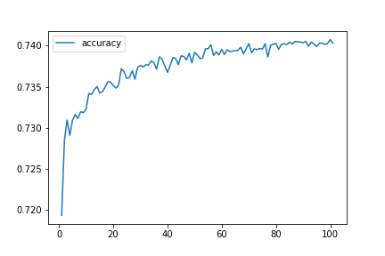 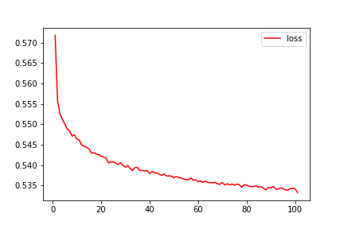 

- - -

```
Neurons: layer 1: 100 ; activation: relu
         layer 2: 40 ; activation: relu
         layer 3: 25 ; activation: selu
         
Epoch: 250    optimizer: adam         
```
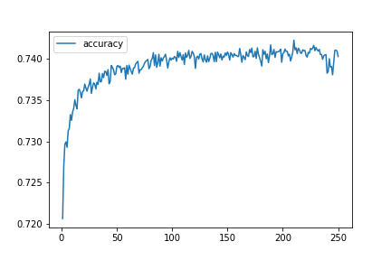 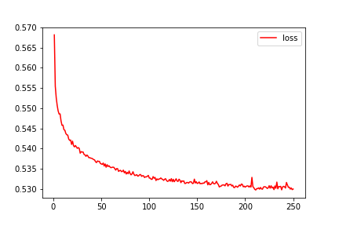 

- - -

```
Neurons: layer 1: 200 ; activation: relu
         layer 2: 150 ; activation: relu
         layer 3: 50 ; activation: relu
         
Epoch: 900    optimizer: adam         
```

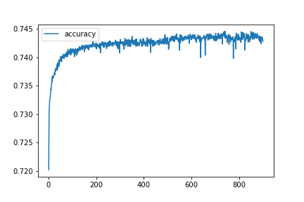 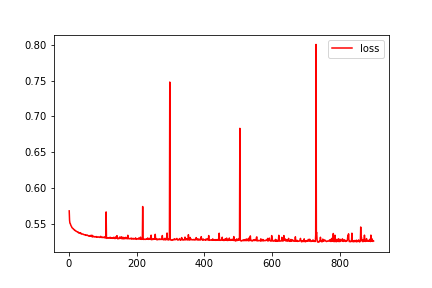 

- - -

```
Neurons: layer 1: 500 ; activation: relu
         layer 2: 275 ; activation: elu
         layer 3: 150 ; activation: tahn
         
Epoch: 2000   optimizer: adadelta         
```

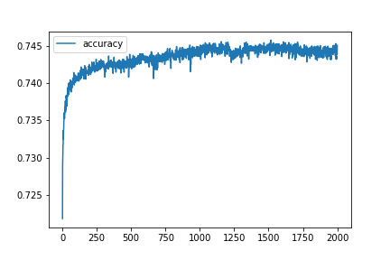 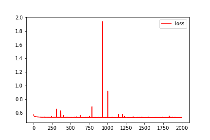 

- - -

```
Neurons: layer 1: 380 ; activation: relu
         layer 2: 200 ; activation: selu
         
Epoch: 1200   optimizer: adam        
```

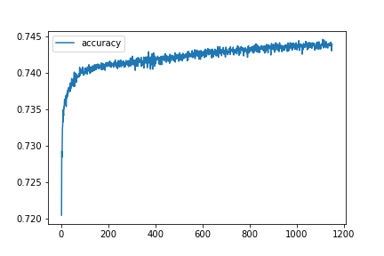 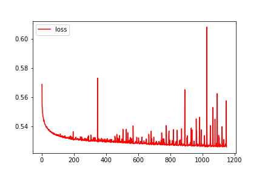

- - -

```
Neurons: layer 1: 15 ; activation: relu
         layer 2: 60 ; activation: relu
         
Epoch: 15   optimizer: adagrad         
```

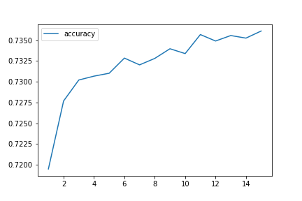 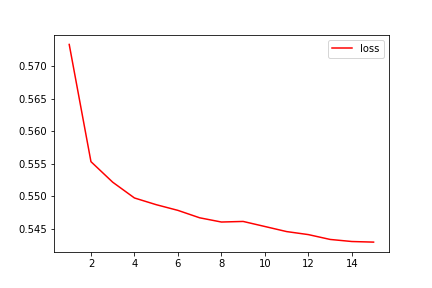 

- - -

```
Neurons: layer 1: 100 ; activation: relu
         layer 2: 30 ; activation: sigmoid
         layer 3: 10 ; activation: sigmoid
         
Epoch: 100    optimizer: adam         
```

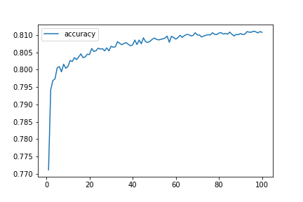 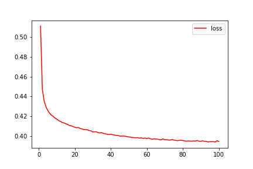 

